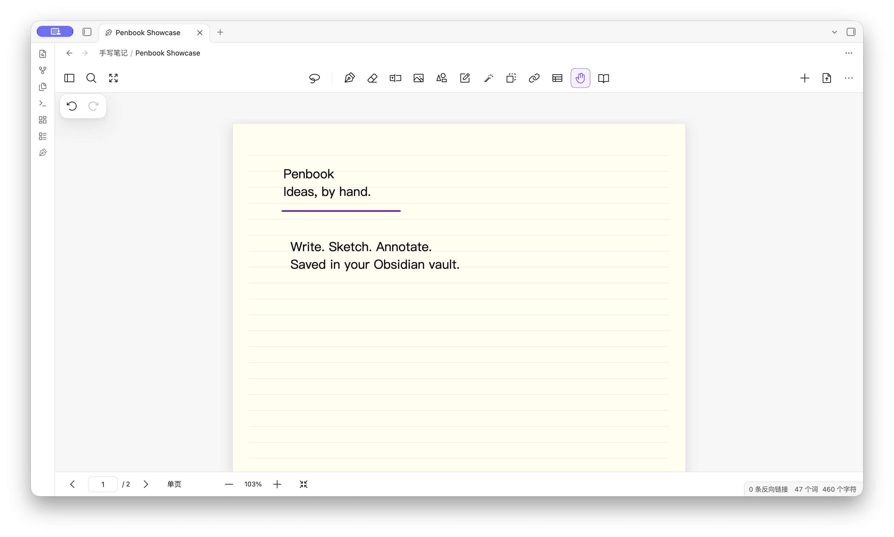
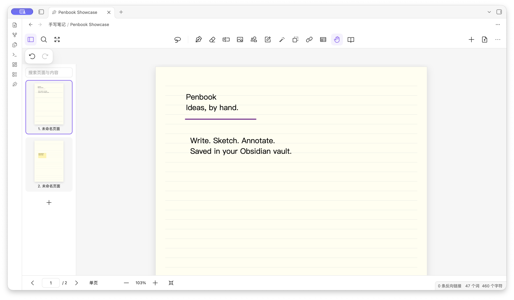
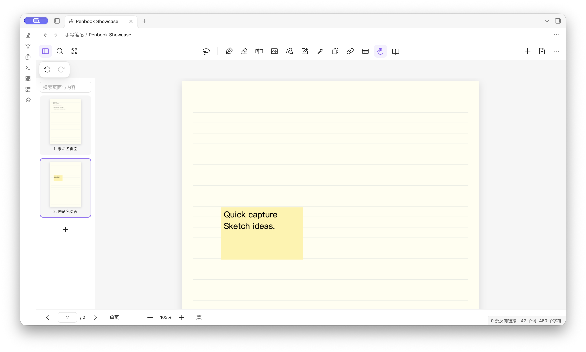
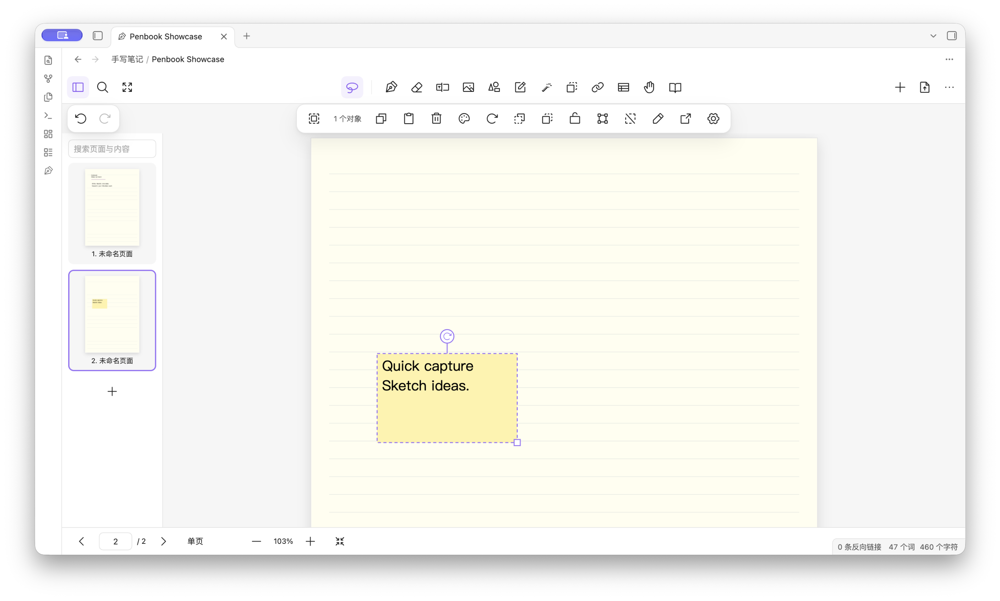
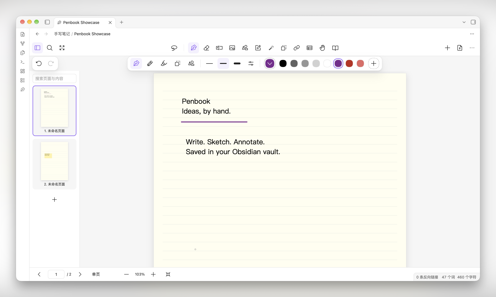
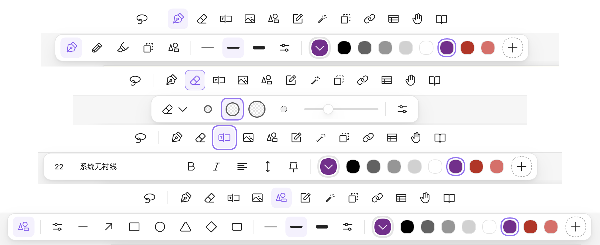

# Penbook

[English](README.md) | 简体中文

**为 Obsidian 打造的 Goodnotes 风格手写体验。**

本项目独立从零实现，与 Goodnotes 无隶属关系，也未获其认可或背书。

Penbook 是一款面向 Obsidian 桌面版和 Android 平板的本地手写笔记插件。它通过 Pointer Events 支持 S Pen 压感输入，运行时不依赖在线服务。每本笔记本都是独立的 `.penbook` JSON 文件，笔迹、页面、图片和原始 PDF 都保存在其中。

界面使用 Obsidian 主题变量，适配当前主题的明暗模式。图标使用 Phosphor Icons regular 风格；圆角矩形和激光笔符号单独绘制，不使用远程图标字体。

工具栏分为两层：上层放置主要工具，下层显示当前工具的圆角设置栏。两层都支持触控滑动、触控板横向滚动和鼠标滚轮。工具栏包含笔型、三档预设笔宽、自定义笔宽、当前颜色和常用颜色，以及页面导航、搜索、选择、书写、PDF 批注、导出和页面选项。

## 截图

<p align="center">
  
  
</p>
<p align="center">
  
  
</p>
<p align="center">
  
  
</p>

## 开始使用

- 在 Obsidian 设置 → 第三方插件中启用 **Penbook**。
- 点击左侧工具栏的钢笔图标，或在命令面板中运行 Penbook 新建笔记本命令。
- 默认笔记本目录为 `手写笔记/`，可在插件设置中修改。
- 可使用 S Pen 或鼠标书写。手指默认用于平移，双指手势用于缩放；也可在工具栏菜单中开启手指书写。
- 如果操作系统通过 Pointer Events 传入笔侧键或橡皮擦端事件，Penbook 会临时切换到橡皮擦。
- 使用套索选择对象。拖动选区可移动对象，拖动右下角控制柄可调整大小。选区工具栏支持旋转、透明度、组合、锁定、图层排序和跨页移动。
- 双击文本、便签或链接即可编辑。在阅读模式下，点击链接可打开其目标。
- 可从库中选择 PDF、从设备导入 PDF，或将 PDF 拖到画布上。导入后每页会成为页面背景，原始 PDF 保存在笔记本中。
- 在页面列表中拖动可调整页面顺序；可通过右键菜单，或触控设备右上角的菜单打开页面选项。
- 导出文件保存在 `手写笔记/导出/`，Markdown 索引文件与笔记本保存在同一目录。
- 使用“复制页面链接”可在 Markdown 中链接到指定页面。也可使用 `penbook` 代码块嵌入页面，内容格式为 `手写笔记/笔记本名称.penbook#页面UUID`。需要先导出预览，图片才能显示。

常用快捷键：`P` 切换钢笔，`E` 切换橡皮擦，`L` 切换套索，`H` 切换平移工具；`Ctrl/Cmd+Z` 撤销，`Ctrl/Cmd+Shift+Z` 重做；`Ctrl/Cmd+C/V` 使用内部选区剪贴板；`Delete` 删除选区；`PageUp/PageDown` 翻页；`Ctrl/Cmd+S` 保存；`Escape` 取消当前笔划或选区。

## 功能

- 钢笔、圆珠笔、毛笔、铅笔和荧光笔，支持压感曲线、颜色、笔宽和本地保存。
- 圆头笔迹、扁平度、压力灵敏度、稳定性、实线/虚线/点线和直线辅助。支持预设颜色、自定义颜色、历史颜色、HEX 输入和页面取色。
- 精细、标准和整笔画橡皮擦。精细模式按光标半径精确擦除接触区域；标准模式按约 3px 的短段切除。笔迹擦断后会按连通部分拆为独立对象。支持尺寸预览、仅擦除荧光笔或胶带，以及擦除后切回前一工具。
- 笔记本封面和纸张画廊、书脊颜色、标准与自定义页面尺寸、页面方向和内置规划模板。
- 胶带遮盖与揭开笔迹；激光笔支持点和线，松开后约一秒淡出；便签支持颜色和已解决状态。
- 文本和便签支持页面内编辑。可设置字号、字体、粗体、斜体、对齐、行距和固定文本模式。桌面端从本机读取已安装字体；Android 使用可用字体列表。
- 支持整笔划和局部擦除、套索选择、移动、缩放、旋转、透明度、组合、锁定和图层排序。
- 支持直线、箭头、矩形、椭圆和三角形，以及文本、便签、图片、链接和空白表格。
- 多页管理、书签、标题、标签、搜索文本对象和 PDF 提取文本、目录，以及在笔记本之间复制或移动页面。
- 空白纸、横线、方格、点阵、康奈尔、五线谱、规划表和任务清单模板；支持图片背景和自定义模板。
- 支持单页、连续滚动和双页布局，以及阅读和沉浸模式、左右手布局和底部工具栏。
- 支持 PDF 页面批注、合并和重排。阅读模式支持选择 PDF 文本。导出 PDF 时保留原页面文字并叠加批注。
- 支持 PDF 导出范围、批注与背景选项、PNG、SVG 笔迹矢量导出、原始文件副本和 Markdown 索引。
- 不调用外部 API、CDN 或在线识别服务。PDF 解析器、字符映射、标准字体和 WASM 资源随插件打包。

## 构建与安装

```sh
npm install
npm run build
```

构建产物位于 `release/penbook/`。将整个目录复制到库的 `.obsidian/plugins/penbook/`，包括 `cmaps/`、`standard_fonts/` 和 `wasm/` 子目录，然后在 Obsidian 中启用插件。插件目录和笔记本也可以复制到 Android 库中使用。

## 文件格式与恢复

`format: "penbook"` 和 `version: 1` 是笔记本格式标识。每页保存纸张、背景引用、对象和文本索引；`resources` 保存 base64 编码的图片和 PDF。解析失败或遇到未知版本时，Penbook 会报告错误并保留原文件，不会将其覆盖为空笔记本。撤销历史仅保存在当前会话内；关闭后不会保留。关闭前可撤销纸张模板修改和页面删除。

笔记本修改后会延迟写入文件，关闭视图时也会保存待处理的修改。导出文件使用独立文件名，避免覆盖已有文件。笔记本文件未加密；请避免在多台设备同步尚未完成时同时编辑同一文件。

## 许可证

Penbook 使用 [MIT 许可证](LICENSE)。第三方组件仍遵循各自的许可证，详见 [第三方许可说明](THIRD_PARTY_NOTICES.md)。
